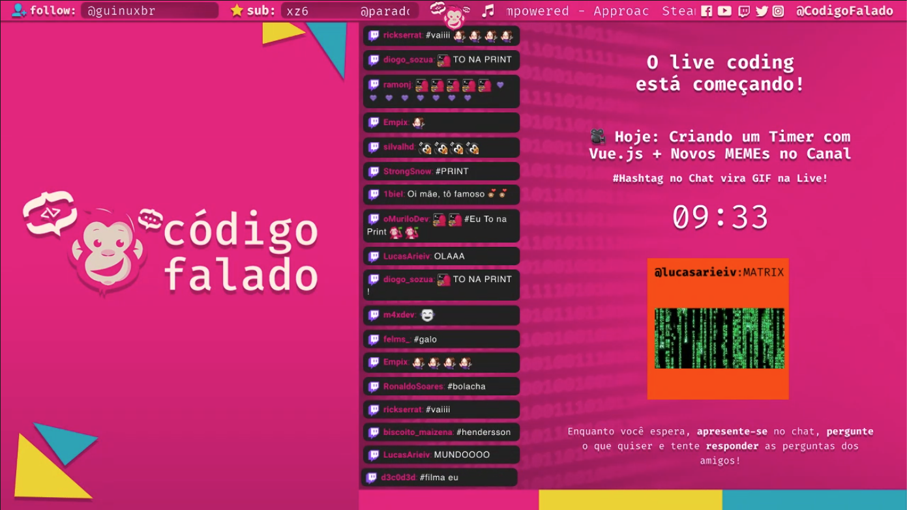

# Tela de Countdown para Streams

Este repositório contém a tela de countdown usada no canal do [Código Falado](https://www.twitch.tv/codigofalado)



## Usando este Countdown

1. Baixe o projeto.
2. Troque a imagem de background por uma imagem do seu canal em `src/assets/img/background.png`.
3. Customize o CSS em `src/App.vue` para deixar com a fonte do seu canal.
4. Rode `npm install` para instalar as dependências.
5. Rode `npm run build` para criar a pasta `dist` contendo o Countdown funcionando.
6. Adicione a url `http://localhost:5000` no OBS via Browser Source
7. Rode `npm run stream` para iniciar um servidor local com o Countdown na porta 5000 **sempre que for começar uma nova Live**.
8. Para definir os textos e o tempo da contagem regressiva entre na url `http://localhost:5000` e pressione CTRL + alt + e que um panel de configuração será aberto, para sair basta pressionar as mesmas teclas novamente ou ESC.

# Customizando o Projeto

## Setup

```
npm install
```

### Compila com suporte a hot-reload para desenvolvimento

```
npm run serve
```

### Compila e minifica para produção

```
npm run build
```

### Inicia um servidor em localhost

```
npm run stream
```

### Lint

```
npm run lint
```

# Servidor externo (opcional)
> Rode o comando abaixo e envie os arquivos da pasta /dist gerada para o seu servidor
```bash
npm run build
```
